| Название                        | 0,33 л                                                                                                                                                                                                                               | 0,45 л                                                                                                                                                                                                                 | 0,75 л             | 1 л                | 30 л                                                                                                                                                                                                                             |
|---------------------------------|--------------------------------------------------------------------------------------------------------------------------------------------------------------------------------------------------------------------------------------|------------------------------------------------------------------------------------------------------------------------------------------------------------------------------------------------------------------------|--------------------|--------------------|----------------------------------------------------------------------------------------------------------------------------------------------------------------------------------------------------------------------------------|
| Мид «Мэрион» Берри              | [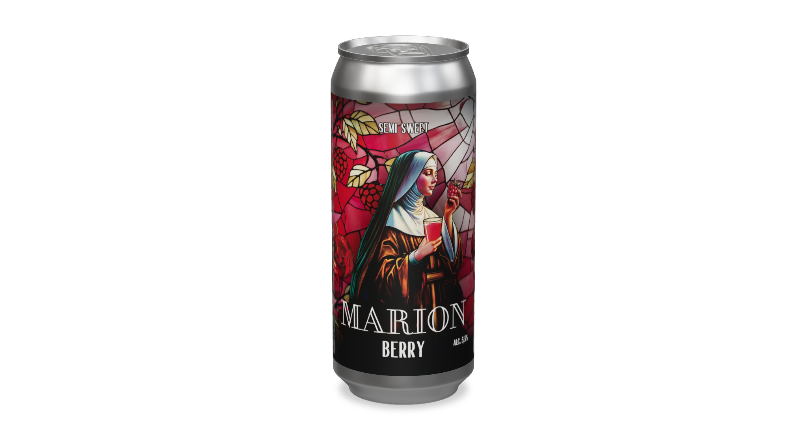](../src/assets/products/mead/marion-berry-330ml.png) Этикетка от 0,45 л Модель от 0,45 л                           |                                                        | НЕТ ТАКОГО РАЗМЕРА | НЕТ ТАКОГО РАЗМЕРА | [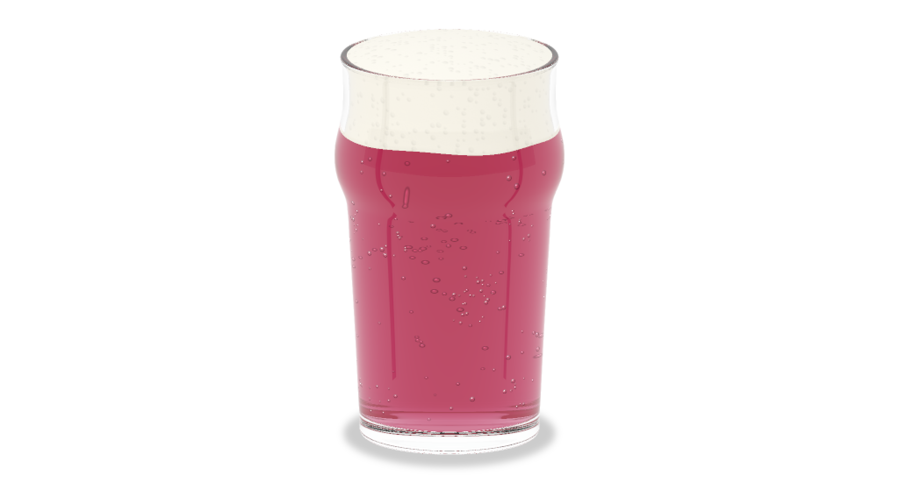](../src/assets/products/mead/marion-pomegranate-berry-glass.png) С пеной, с пузырьками        |
| Мид «Мэрион» Манго              |  Этикетка от 0,45 л Модель от 0,45 л                           |                                                        | НЕТ ТАКОГО РАЗМЕРА | СДЕЛАТЬ            | [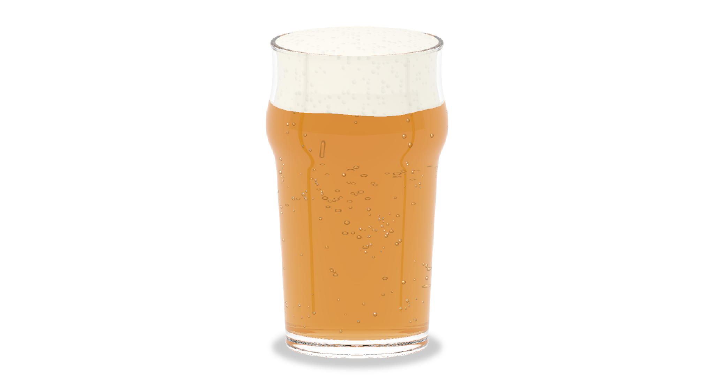](../src/assets/products/mead/marion-mango-glass.png) С пеной, с пузырьками                                |
| Мид «Мёдведь» Клюквенная        | НЕТ ТАКОГО РАЗМЕРА                                                                                                                                                                                                                   | НЕТ ТАКОГО РАЗМЕРА                                                                                                                                                                                                     | НЕТ ТАКОГО РАЗМЕРА | СДЕЛАТЬ            | [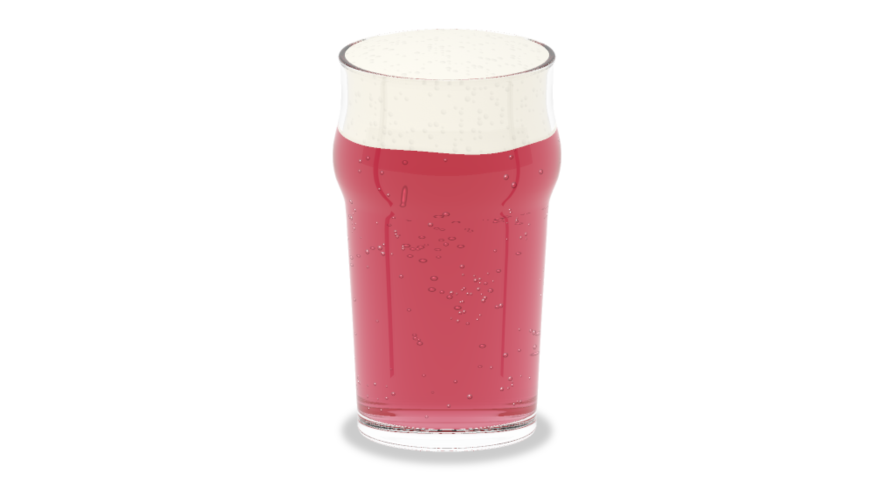](../src/assets/products/mead/medved-cranberry-glass.png) С пеной, с пузырьками                  |
| Мид «Мёдведь» с лесными ягодами | НЕТ ТАКОГО РАЗМЕРА                                                                                                                                                                                                                   | НЕТ ТАКОГО РАЗМЕРА                                                                                                                                                                                                     | НЕТ ТАКОГО РАЗМЕРА | СДЕЛАТЬ            | [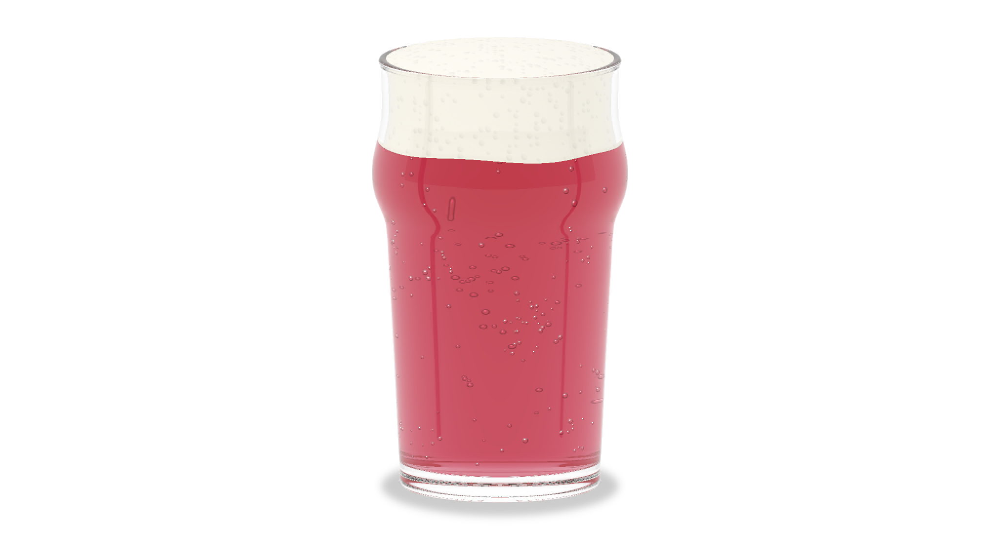](../src/assets/products/mead/medved-forest-berries-glass.png) С пеной, с пузырьками |
| Мид «Мёдведь» Облепиховая       | НЕТ ТАКОГО РАЗМЕРА                                                                                                                                                                                                                   | НЕТ ТАКОГО РАЗМЕРА                                                                                                                                                                                                     | НЕТ ТАКОГО РАЗМЕРА | СДЕЛАТЬ            | [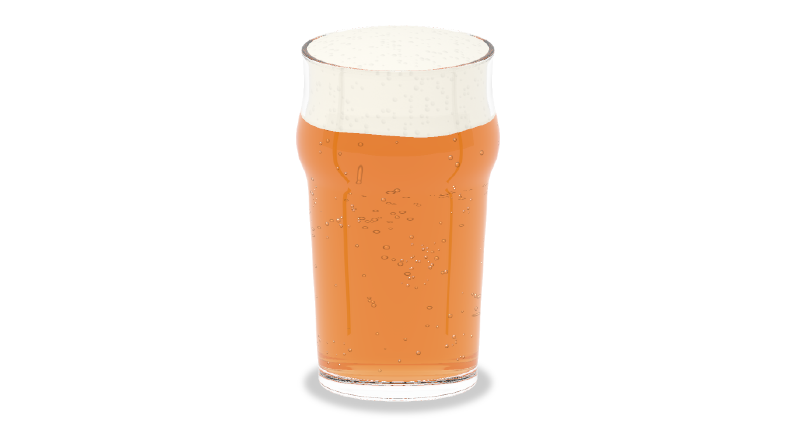](../src/assets/products/mead/medved-sea-buckthorn-glass.png) С пеной, с пузырьками         |
| Мид «Мёдведь» Сливовая          | НЕТ ТАКОГО РАЗМЕРА                                                                                                                                                                                                                   | НЕТ ТАКОГО РАЗМЕРА                                                                                                                                                                                                     | НЕТ ТАКОГО РАЗМЕРА | СДЕЛАТЬ            | [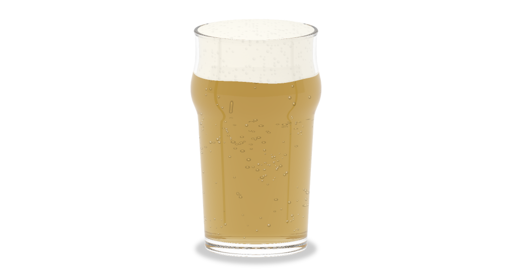](../src/assets/products/mead/medved-plum-glass.png) С пеной, с пузырьками                              |
| Мид «Мэрион» Черносмородиновая  | [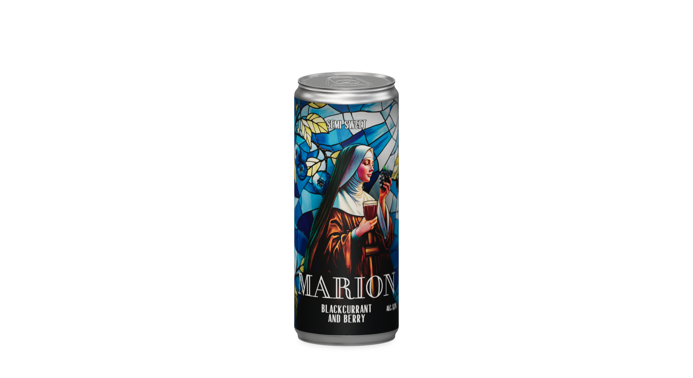](../src/assets/products/mead/marion-blackcurrant-330ml.png) Этикетка от 0,45 л Модель от 0,45 л |                | НЕТ ТАКОГО РАЗМЕРА | СДЕЛАТЬ            | [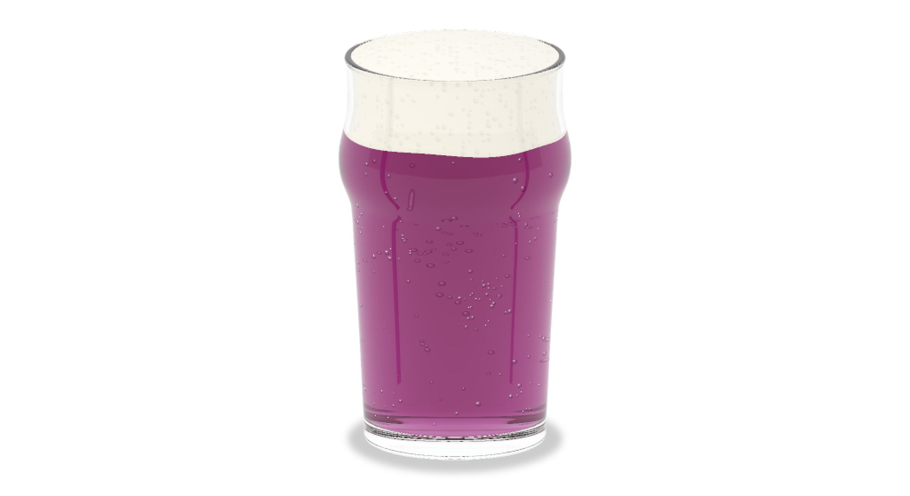](../src/assets/products/mead/medved-blackcurrant-glass.png) С пеной, с пузырьками      |
| Мид «Мёдведь» Тёмная            |  Этикетка от 0,45 л Модель от 0,45 л                           | [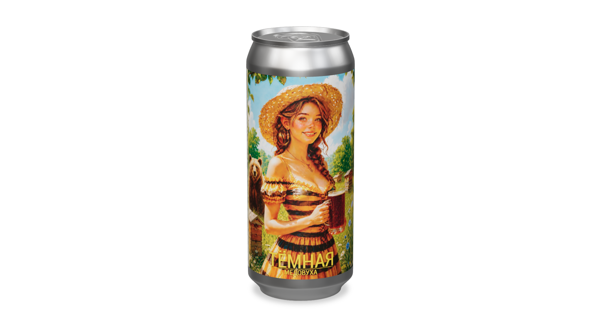](../src/assets/products/mead/medved-dark-450ml.png)                                                       | НЕТ ТАКОГО РАЗМЕРА | СДЕЛАТЬ            | НЕТ ТАКОГО РАЗМЕРА                                                                                                                                                                                                               |
| Мид «Мёдведь» Светлая           | [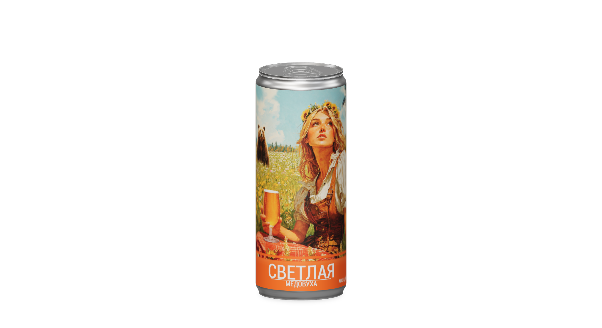](../src/assets/products/mead/medved-light-330ml.png) Этикетка от 0,45 л Модель от 0,45 л                        | [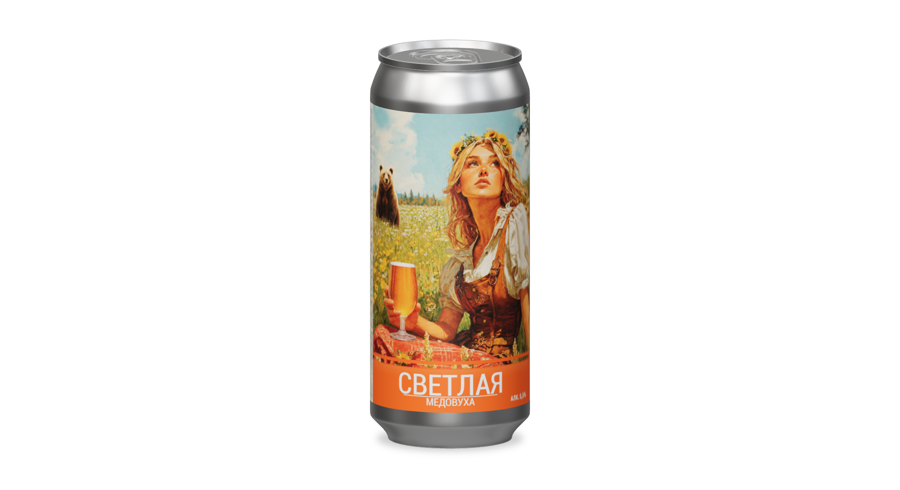](../src/assets/products/mead/medved-light-450ml.png)                                                    | НЕТ ТАКОГО РАЗМЕРА | СДЕЛАТЬ            | НЕТ ТАКОГО РАЗМЕРА                                                                                                                                                                                                               |
| Мид «Мёдведь» Вишнёвая          | НЕТ ТАКОГО РАЗМЕРА                                                                                                                                                                                                                   | НЕТ ТАКОГО РАЗМЕРА                                                                                                                                                                                                     | НЕТ ТАКОГО РАЗМЕРА | СДЕЛАТЬ            | НЕТ ТАКОГО РАЗМЕРА                                                                                                                                                                                                               |
| Сидр «Хмеляр»                   |  Модель от 0,45 л                                                            |  Этикетка от 0,33 л                        | НЕТ ТАКОГО РАЗМЕРА | НЕТ ТАКОГО РАЗМЕРА | [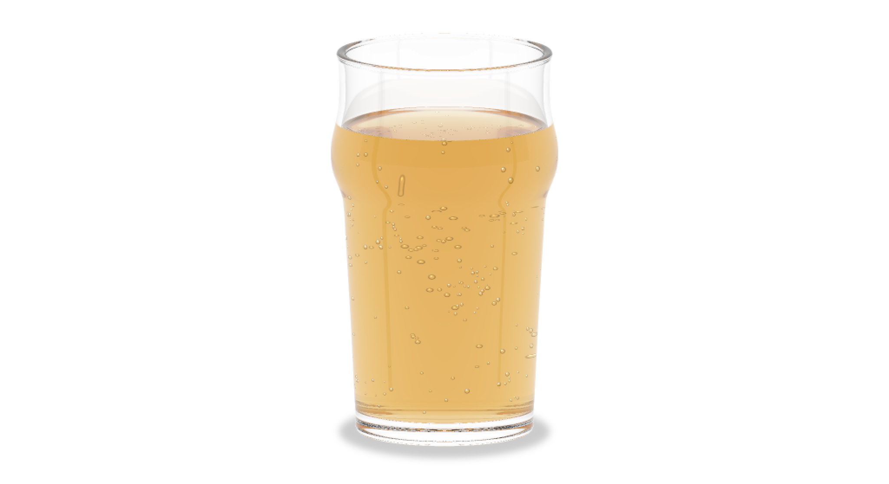](../src/assets/products/cider/khmelyar-glass.png) Без пены, с пузырьками                                          |
| Сидр «Вудсток»                  |  Модель от 0,45 л                                                         |  Этикетка от 0,33 л                     | НЕТ ТАКОГО РАЗМЕРА | НЕТ ТАКОГО РАЗМЕРА | [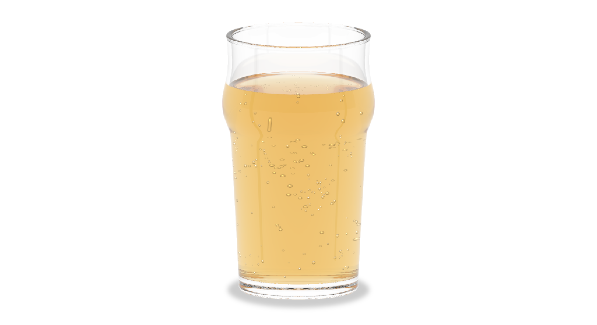](../src/assets/products/cider/woodstock-glass.png) Без пены, с пузырьками                                       |
| Сидр «Мэрион» Берри             |  Этикетка от 0,45 л Модель от 0,45 л                        |                                                     | НЕТ ТАКОГО РАЗМЕРА | НЕТ ТАКОГО РАЗМЕРА | [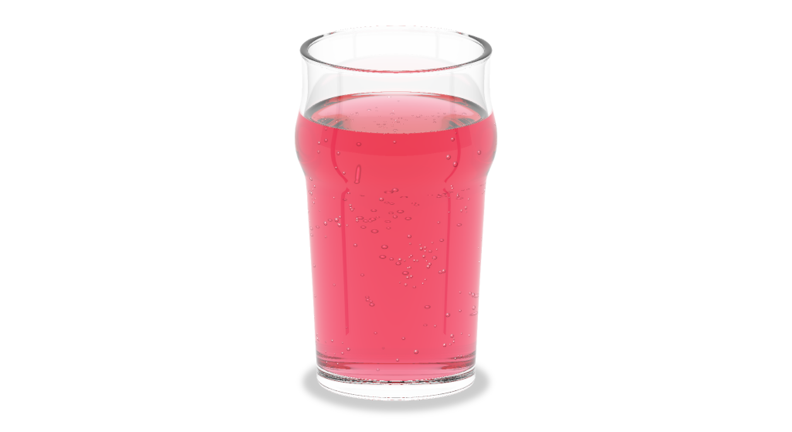](../src/assets/products/cider/marion-berry-glass.png) Без пены, с пузырьками                            |
| Сидр Вишневый                   |  Модель от 0,45 л                                                                |  Этикетка от 0,33 л                            | СДЕЛАТЬ            | НЕТ ТАКОГО РАЗМЕРА | [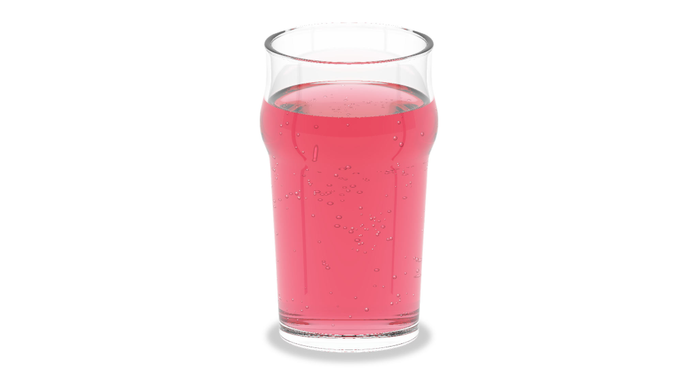](../src/assets/products/cider/cherry-glass.png) Без пены, с пузырьками                                              |
| Сидр «Антоновка»                |  Этикетка от 0,45 л Модель от 0,45 л                                 |                                                              | СДЕЛАТЬ            | НЕТ ТАКОГО РАЗМЕРА | [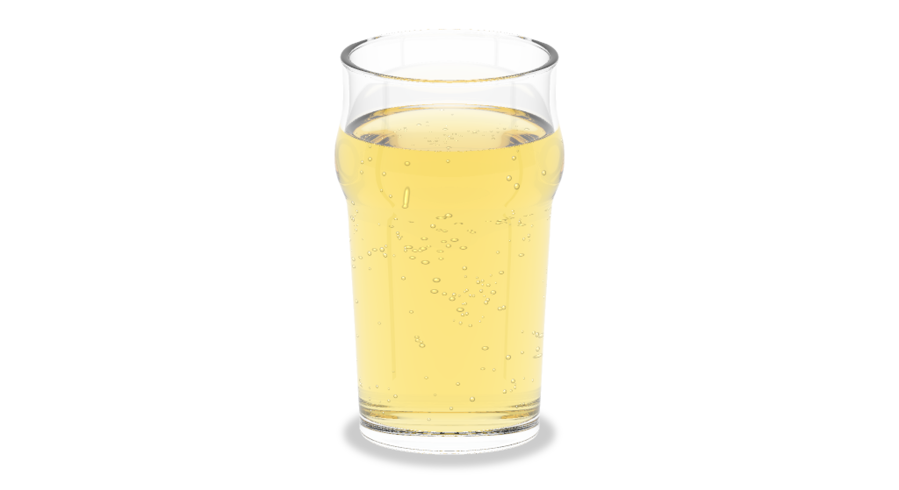](../src/assets/products/cider/antonovka-glass.png) Без пены, с пузырьками                                     |
| Пуаре «Мистер Вильямс»          |  Модель от 0,45 л                                     |  Этикетка от 0,33 л | СДЕЛАТЬ            | СДЕЛАТЬ            | [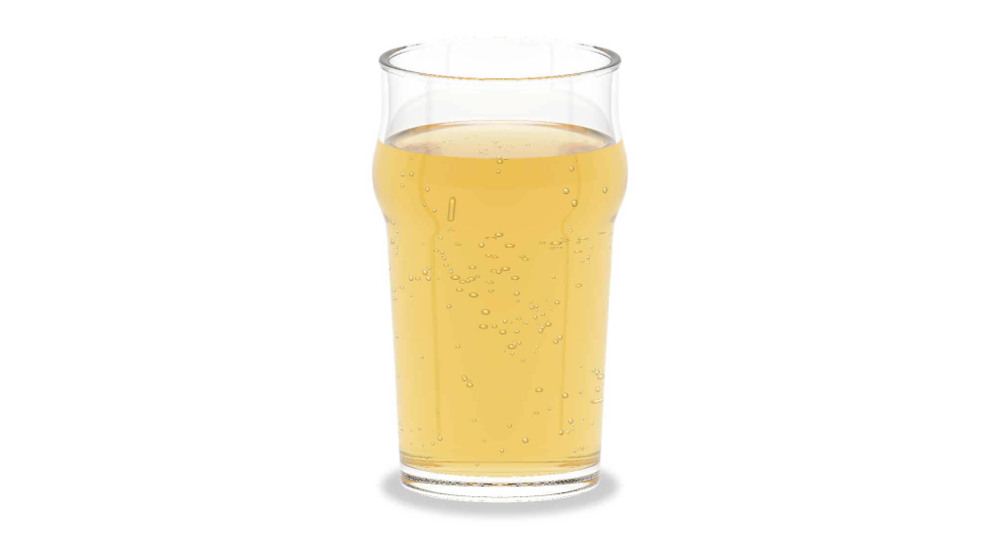](../src/assets/products/perry/mister-williams-glass.png) Без пены, с пузырьками                   |
